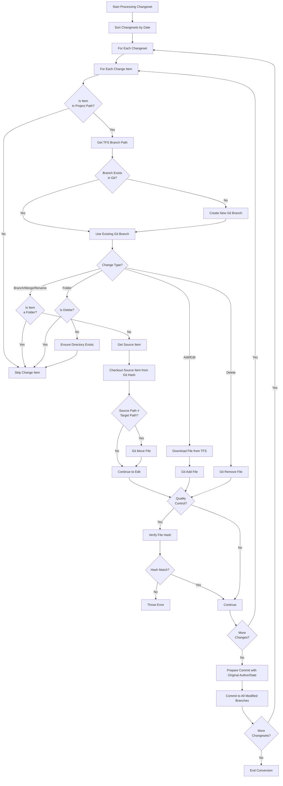

# TeamFoundationServer

Utility scripts and tools for Team Foundation Server (TFS) and Azure DevOps Server, providing migration and management capabilities.

## Overview

This repository contains PowerShell scripts that help with TFS management tasks, particularly focusing on migration to Git. These utilities are designed to be auditable, secure, and suitable for use in regulated/enterprise environments.

## Utilities

### ConvertTo-Git.ps1

A comprehensive TFVC to Git migration tool that accurately preserves your project history by replaying all changes chronologically, in effective reviewable code.

**Key Features:**

- Creates a unified source tree with branches for the complete TFS project, for consistent handling of large projects
- TFS branches are processed as directories (owners will split to the required branches after migration)
- Recursively processes all changesets through the entire project hierarchy
- Preserves complete commit history with original timestamps and authors
- Handles all TFVC change types (add, edit, delete, rename, branch)
- Supports secure authentication methods
- Optimized for pipeline execution in Azure DevOps

**When to use this approach:**

While this migration approach can be slower than other methods, it provides several advantages:
- Transparent, auditable conversion process with simple, reviewable code
- Consistent handling of complex projects with many stale and deleted branches
- Complete preservation of history, including changesets, timestamps, and authors
- Suitable for regulated environments requiring migration validation

**Design choices:**
- TFS Branches are persistent, that is - TFS branch deletion is implemented as files deletion, persisting the git branch. If requested again the git branch will be reused by a merge operation.

**TFS to GIT Flow**

## License

This project is licensed under the MIT License - see the LICENSE file for details.

## Contributing

Contributions are welcome! Please feel free to submit a Pull Request.
